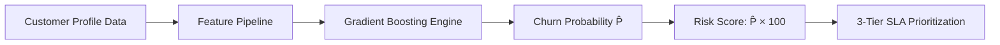
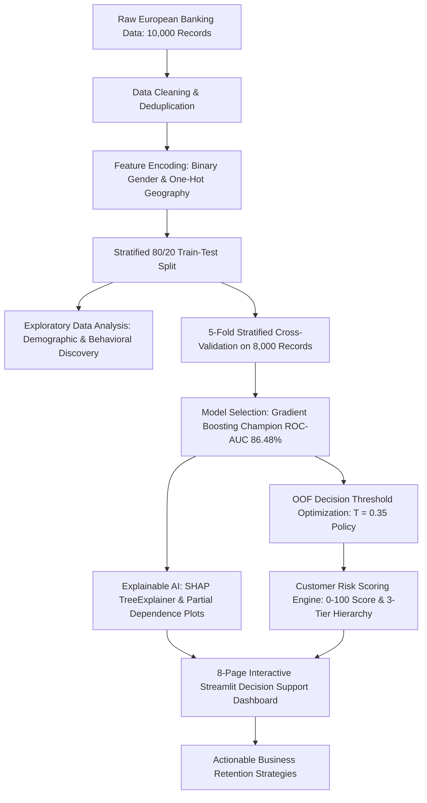

# 🏦 Bank Customer Churn Analytics & Risk Scoring
### *Exploratory Data Analysis, Predictive Risk Modeling, Decision Calibration & Interactive Retention Intelligence Suite*

[](https://python.org)
[](https://streamlit.io)
[](https://scikit-learn.org)
[](https://xgboost.readthedocs.io)
[](https://shap.readthedocs.io)
[](https://opensource.org/licenses/MIT)

---

## 📑 Table of Contents

- [1. Project Summary](#1-project-summary)
- [2. Business Problem](#2-business-problem)
- [3. Objectives](#3-objectives)
- [4. Dataset Overview](#4-dataset-overview)
- [5. Key Business Questions](#5-key-business-questions)
- [6. Data Preparation](#6-data-preparation)
- [7. Exploratory Data Analysis (EDA)](#7-exploratory-data-analysis-eda)
- [8. Key Churn Insights](#8-key-churn-insights)
- [9. Feature Engineering](#9-feature-engineering)
- [10. Predictive Modeling](#10-predictive-modeling)
- [11. Model Evaluation & Decision Calibration](#11-model-evaluation--decision-calibration)
- [12. Explainable AI (XAI) with SHAP & PDP](#12-explainable-ai-xai-with-shap--pdp)
- [13. Customer Risk Scoring Framework](#13-customer-risk-scoring-framework)
- [14. Interactive Streamlit Dashboard](#14-interactive-streamlit-dashboard)
- [15. Actionable Business Recommendations](#15-actionable-business-recommendations)
- [16. Project Architecture & Workflow](#16-project-architecture--workflow)
- [17. Technology Stack](#17-technology-stack)
- [18. Project Structure](#18-project-structure)
- [19. How to Run the Project](#19-how-to-run-the-project)
- [20. Project Limitations](#20-project-limitations)
- [21. Future Improvements](#21-future-improvements)
- [22. Repository Metadata & Topics](#22-repository-metadata--topics)
- [23. Author & Credits](#23-author--credits)

---

## 1. Project Summary

Customer attrition poses a significant threat to retail banking profitability and liquid capital reserves. This project delivers an end-to-end **data analytics, predictive risk scoring, and decision-support system** trained on **10,000 European retail banking accounts**. 

By pairing rigorous exploratory data analysis with machine learning (Gradient Boosting champion achieving **86.31% ± 0.99% 5-fold cross-validation accuracy** and **87.08% holdout ROC-AUC**), the platform translates churn probabilities into a standardized **0–100 Risk Score** and **3-tier SLA triage matrix**. Integrated with game-theoretic **SHAP explainability** and deployed across an **8-page interactive Streamlit dashboard**, this system transforms post-exit reporting into proactive, evidence-based retention decision-making.

### Core Value Deliverables

| Deliverable | Key Metric / Capability | Business Impact |
| :--- | :--- | :--- |
| **🎯 Champion Classifier** | **87.08% Holdout ROC-AUC** · 87.00% Accuracy | High-conviction customer flight prediction |
| **🛡️ Validation Protocol** | **5-Fold Stratified Cross-Validation** | Zero data leakage; statistically verified generalizability |
| **💼 Threshold Calibration** | **+22.61% Churn Capture Gain** ($T = 0.35$) | Salvages +45 additional churners per 2,000 accounts |
| **🔍 Explainable AI (XAI)** | **SHAP TreeExplainer & Partial Dependence** | Full auditability aligned with GDPR Article 22 & EU AI Act |
| **💰 Capital Triage** | **Value-at-Risk (VAR) Exposure Index** | Prioritizes high-balance depositor retention workflows |
| **🖥️ Decision Hub** | **8-Page Interactive Streamlit Suite** | Real-time scoring, cohort filtering, and what-if simulation |

---

## 2. Business Problem

In commercial and retail banking:
- **Acquisition Economics**: Acquiring a new retail depositor costs **5× to 25× more** than retaining an existing account holder.
- **Liquidity Depletion**: When high-balance depositors leave, institutions lose recurring net interest margin (NIM), interchange fees, and foundational deposit liquidity used to fund loan portfolios.
- **Operational Blindspots**: Traditional banking operations rely on backward-looking exit surveys after accounts are closed, forfeiting the opportunity to intervene while customer relationships can still be salvaged.

### Decision Support Impact
This system equips bank relationship managers, portfolio risk leads, and executive leadership with:
1. **Early Identification**: Pinpointing accounts with elevated churn probability before attrition events occur.
2. **Value-at-Risk Prioritization**: Weighting customer flight probability by deposit balance and salary proxy to focus high-touch outreach on high-exposure accounts.
3. **Targeted Interventions**: Providing transparent, customer-level feature attribution to guide tailored retention offers (e.g., fee waivers, relationship reviews, digital onboarding).

---

## 3. Objectives

The primary analytical and engineering objectives of this project are:

1. **Analyze Churn Patterns**: Perform comprehensive exploratory data analysis on demographic, geographic, and behavioral variables across 10,000 customer records.
2. **Identify Risk Drivers**: Quantify non-linear relationships between customer churn and key attributes including age, product depth, geographic market, balance, and digital activity.
3. **Develop Predictive Models**: Build, cross-validate, and evaluate 5 candidate classification architectures using **5-Fold Stratified Cross-Validation** with a zero-leakage protocol.
4. **Calibrate Decision Thresholds**: Optimize operational classification thresholds on out-of-fold predictions ($T = 0.35$ vs. default $0.50$) to capture **+22.61% additional churners** without overburdening retention teams.
5. **Establish Customer Risk Scoring**: Map model probabilities into continuous risk scores (0–100) and structured risk categories (Low, Medium, High).
6. **Provide Model Explainability**: Implement **SHAP TreeExplainer** and **Partial Dependence Plots (PDP)** to ensure transparent, auditable, and regulatory-aligned predictions.
7. **Deliver Interactive Decision Support**: Deploy an 8-page Streamlit web dashboard for executive KPI tracking, portfolio triage filtering, individual/batch customer scoring, and what-if retention ROI simulation.

---

## 4. Dataset Overview

The analysis is conducted on the **European Retail Banking Customer Churn Dataset** located at `data/Raw/European_Bank.csv` and processed in `data/Processed/customer_risk_report.csv`.

### Cohort Summary
- **Total Records**: `10,000` customer accounts
- **Total Raw Columns**: `14` attributes
- **Target Variable**: `Exited` (Binary: `0` = Retained, `1` = Churned)
- **Target Distribution**:
  - **Retained ($0$)**: `7,963` accounts (**79.63%**)
  - **Churned ($1$)**: `2,037` accounts (**20.37%**)
- **Data Integrity**: **0 missing values**, **0 duplicate records** across the entire 10,000-record cohort.

### Feature Dictionary

| Feature Name | Data Type | Value Range / Categories | Description | Analytical Role |
| :--- | :--- | :--- | :--- | :--- |
| **Year** | `int64` | `2025` | Reporting collection year | Administrative (Dropped) |
| **CustomerId** | `int64` | `15565701` – `15815690` | Unique customer identifier | Identifier (Dropped) |
| **Surname** | `object` | `2,932` unique surnames | Customer family name | Identifier (Dropped) |
| **CreditScore** | `int64` | `350` – `850` (Mean: `650.53`) | Bureau creditworthiness rating | Financial Feature |
| **Geography** | `object` | `France` (50.14%), `Germany` (25.09%), `Spain` (24.77%) | Country of account residence | Categorical Feature |
| **Gender** | `object` | `Male` (54.57%), `Female` (45.43%) | Customer biological gender | Categorical Feature |
| **Age** | `int64` | `18` – `92` years (Mean: `38.92`) | Customer age in years | Demographic Feature |
| **Tenure** | `int64` | `0` – `10` years (Mean: `5.01`) | Years of banking relationship | Relationship Feature |
| **Balance** | `float64` | `€0.00` – `€250,898.09` (Mean: `€76,485.89`) | Total liquid deposit balance | Financial Feature |
| **NumOfProducts** | `int64` | `1`, `2`, `3`, `4` (Mean: `1.53`) | Number of active bank products held | Product Feature |
| **HasCrCard** | `int64` | `0` = No (29.45%), `1` = Yes (70.55%) | Active payment/credit card indicator | Engagement Feature |
| **IsActiveMember**| `int64` | `0` = No (48.49%), `1` = Yes (51.51%) | Digital/operational activity indicator | Engagement Feature |
| **EstimatedSalary**| `float64`| `€11.58` – `€199,992.48` (Mean: `€100,090.24`) | Modeled gross annual salary | Financial Feature |
| **Exited** | `int64` | `0` = Retained (79.63%), `1` = Churned (20.37%) | Target churn classification label | Target Variable |

---

## 5. Key Business Questions

This project answers six core commercial questions:

1. **Geographic Concentration**: Why does customer churn in Germany (**32.44%**) double that of France (**16.15%**) and Spain (**16.67%**)?
2. **Product Depth Dynamics**: Why does holding 2 bank products minimize churn (**7.58%**), while holding 3+ products causes catastrophic churn (**82.71% – 100.00%**)?
3. **Demographic Risk Profiles**: Which age cohorts exhibit the steepest attrition rates, and how does wealth profile correlate with age-driven departures?
4. **Engagement Mitigation**: How much does active membership status reduce attrition risk across customer segments?
5. **Capital Exposure Prioritization**: How can relationship management teams combine predicted probabilities with deposit balance to rank-order accounts by Value-at-Risk?
6. **Retention Operating Economics**: How does calibrating the decision threshold to $0.35$ maximize saved customer Lifetime Value (CLV) compared to symmetric $0.50$ classification?

---

## 6. Data Preparation

Data cleaning and preprocessing steps were executed systematically to prevent data leakage and ensure reproducibility across training, validation, and dashboard inference:

| Pipeline Step | Operation Implemented | Details & Parameters |
| :--- | :--- | :--- |
| **Missing Values** | Verified Clean | 0 nulls detected across all 14 attributes; no imputation required |
| **Duplicate Checks** | Deduplication Audit | 0 duplicate records found; 10,000 unique customer entities verified |
| **Feature Selection** | Column Filtering | Removed uninformative columns (`Year`, `CustomerId`, `Surname`) |
| **Categorical Encoding** | Binary & One-Hot Encoding | `Gender` mapped to Binary (`Male` = 1, `Female` = 0); `Geography` one-hot encoded with `drop_first=True` (`Geography_Germany`, `Geography_Spain`; reference: `France`) |
| **Train/Test Splitting** | Stratified Holdout Split | **80% Training Set (8,000 records)** and **20% Test Set (2,000 records)**; stratified on `Exited` (`random_state=42`) |
| **Feature Scaling** | StandardScaler Normalization | Fitted strictly on training set ($X_{\text{train}}$) and applied to $X_{\text{test}}$ for distance-based models (Logistic Regression); tree-based models preserve native feature thresholds |
| **Input Validation** | Range Clamping & Order Enforcement | Input boundaries enforced (`CreditScore`: [300, 900], `Age`: [18, 100], `Tenure`: [0, 10], `NumOfProducts`: [1, 4]) to ensure safe production scoring |

---

## 7. Exploratory Data Analysis (EDA)

Exploratory analysis was conducted in `notebooks/Bank_Churn_Analysis.ipynb` across univariate, bivariate, and multivariate dimensions:

### Portfolio Summary Breakdown

| Segment Dimension | Sub-Group Breakdown | Share of Cohort (%) | Churn Rate (%) | Retained vs. Churned Counts |
| :--- | :--- | :---: | :---: | :--- |
| **Entire Cohort** | All Retail Accounts | 100.00% (10,000) | **20.37%** | 7,963 Retained / 2,037 Churned |
| **Geography** | France<br>Germany<br>Spain | 50.14% (5,014)<br>25.09% (2,509)<br>24.77% (2,477) | 16.15%<br>**32.44%**<br>16.67% | 4,204 Ret. / 810 Churned<br>1,695 Ret. / 814 Churned<br>2,064 Ret. / 413 Churned |
| **Product Holding** | 1 Product<br>2 Products (Optimal ⭐)<br>3 Products<br>4 Products | 50.84% (5,084)<br>45.90% (4,590)<br>2.66% (266)<br>0.60% (60) | 27.71%<br>**7.58%**<br>**82.71%**<br>**100.00%** | 3,675 Ret. / 1,409 Churned<br>4,242 Ret. / 348 Churned<br>46 Ret. / 220 Churned<br>0 Ret. / 60 Churned |
| **Activity Status** | Active Member<br>Inactive Member | 51.51% (5,151)<br>48.49% (4,849) | **14.27%**<br>**26.85%** | 4,416 Ret. / 735 Churned<br>3,547 Ret. / 1,302 Churned |
| **Gender** | Female<br>Male | 45.43% (4,543)<br>54.57% (5,457) | **25.07%**<br>**16.46%** | 3,404 Ret. / 1,139 Churned<br>4,559 Ret. / 898 Churned |

---

### Comparative Cohort Statistics

| Dimension | Retained Cohort ($N=7,963$) | Churned Cohort ($N=2,037$) | Observed Difference / Delta |
| :--- | :---: | :---: | :--- |
| **Average Age** | `37.41 years` | `44.84 years` | **+7.43 years older** on average in churned cohort |
| **Average Balance** | `€72,745.30` | `€91,108.54` | **+€18,363.24 higher** balance in churned cohort |
| **Average Credit Score**| `651.85` | `645.35` | Minimal variation ($-6.50$ points) |
| **Average Estimated Salary**| `€99,738.39` | `€101,465.68` | Uniform distribution across income quartiles |
| **Active Member Share** | `55.46%` | `36.08%` | **-19.38% lower** active participation among churners |
| **Credit Card Ownership** | `70.71%` | `69.91%` | Negligible impact on churn decision ($\Delta = -0.80\%$) |

---

## 8. Key Churn Insights

Analytical exploration established six evidence-based findings:

### 📌 Finding 1: Geographic Disparity — The Germany Inflection
- **Germany accounts churn at 32.44%** (814 / 2,509), compared to **16.15% in France** (810 / 5,014) and **16.67% in Spain** (413 / 2,477).
- German depositors maintain significantly higher account balances (mean: `€119,730.12` vs. `€62,094.03` in France), indicating that churn in Germany drives disproportionate liquid capital flight.

### 📌 Finding 2: The Multi-Product Paradox
- **1 Product**: 27.71% churn rate (5,084 customers).
- **2 Products**: **7.58% churn rate (Optimal Retention Zone ⭐)** across 4,590 customers.
- **3 Products**: **82.71% churn rate (Severe Risk ⚠️)** across 266 customers.
- **4 Products**: **100.00% churn rate (Extreme Risk 🚨)** across 60 customers.
- *Insight*: Adopting a second banking product creates strong relationship lock-in; however, holding 3 or 4 products creates fee friction, account complexity, and operational dissatisfaction.

### 📌 Finding 3: The Engagement Shield (Activity Multiplier)
- **Inactive Members**: **26.85% churn rate** (1,302 / 4,849).
- **Active Members**: **14.27% churn rate** (735 / 5,151).
- Inactivity increases customer attrition probability by **1.88×**. Digital and operational inactivity serves as the strongest leading indicator of impending account closure.

### 📌 Finding 4: Age Demographic Vulnerability
- Customers aged **45–60** exhibit the highest attrition rate (**~56%**), peaking between ages 50–55.
- Younger depositors (18–35) exhibit high retention (>88%). Mature depositors represent established professionals actively consolidating wealth or seeking competitive yield offerings elsewhere.

### 📌 Finding 5: High-Balance Flight Risk
- Customers in the upper balance quartile (>€127,644) exhibit a **23.68% churn rate**, and churned depositors average **€91,108.54** in balances vs. €72,745.30 for retained customers.
- Zero-balance depositors (primarily in France and Spain) churn at a lower rate (13.8%), indicating that high-balance account holders are more yield-sensitive.

### 📌 Finding 6: Credit Score & Salary Invariance
- Churn rates remain virtually flat across credit score tiers (645 vs. 651) and salary quartiles (~19.9% to 21.5%), proving that creditworthiness and gross compensation do not independently drive attrition decisions.

---

## 9. Feature Engineering

Features engineered and transformed for model training and portfolio triage include:

| Feature Name | Type | Definition & Mathematical Representation | Business & Modeling Rationale |
| :--- | :--- | :--- | :--- |
| **`Geography_Germany`** | Binary Indicator | `1 if Geography == 'Germany' else 0` | Captures high-risk German market dynamics (32.44% baseline churn) |
| **`Geography_Spain`** | Binary Indicator | `1 if Geography == 'Spain' else 0` | Captures Spanish market baseline relative to France reference |
| **`Gender`** | Binary Indicator | `1 if Gender == 'Male' else 0` | Accounts for gender-level churn differential (Female: 25.07% vs. Male: 16.46%) |
| **`Balance_Category`** | Categorical Bin | `Low (<= €0), Medium (€0 - €97K), High (> €97K)` | Enables segment-level financial footprint comparisons during EDA |
| **`Salary_Category`** | Categorical Bin | `Low, Medium, High, Very High` (Quartile bins) | Verifies salary invariance and demographic neutrality |
| **`Customer Value Proxy (CVP)`** | Financial Metric | $\text{CVP} = \text{Balance} + (0.5 \times \text{EstimatedSalary})$ | Quantifies total liquid and earning capital associated with each account |
| **`Value-at-Risk (VAR)`** | Exposure Index | $\text{Loss Exposure} = \text{CVP} \times \hat{P}(\text{Churn})$ | Combines predictive churn probability with customer value to rank retention priority |

---

## 10. Predictive Modeling

Five candidate machine learning architectures were trained on the **8,000-record training partition** using **5-Fold Stratified Cross-Validation** and evaluated against the isolated **2,000-record holdout test cohort**.

### Candidate Algorithms Evaluated
1. **Gradient Boosting Classifier (Champion)**: Sequential ensemble boosting decision trees on residual pseudo-losses (`learning_rate=0.1`, `n_estimators=100`, `max_depth=3`).
2. **XGBoost Classifier (Benchmark)**: Extreme Gradient Boosting with regularized objective loss (`n_estimators=100`, `max_depth=3`).
3. **Random Forest Classifier (Benchmark)**: Bagged ensemble of 100 randomized decision trees (`n_estimators=100`, `random_state=42`).
4. **Logistic Regression (Linear Baseline)**: L2-regularized logistic regression fitted on StandardScaler-normalized features (`max_iter=1000`).
5. **Decision Tree Classifier (Non-Linear Baseline)**: Single CART classification tree (`random_state=42`).

### Model Selection Rationale
Gradient Boosting was selected as the **Production Champion** based on:
- Highest mean cross-validation discrimination: **86.48% ± 0.99% ROC-AUC**.
- Highest cross-validation precision: **77.22% ± 3.17%**.
- Superior generalization on untouched holdout test data (**87.08% ROC-AUC**, **87.00% Accuracy**, **79.28% Precision**).

---

## 11. Model Evaluation & Decision Calibration

### 1. 5-Fold Stratified Cross-Validation Benchmark (8,000 Records)
*Evaluated across 5 stratified folds on the training dataset to ensure zero data leakage and stable variance:*

| Model Architecture | Model Family | CV Accuracy $\pm$ Std | CV Precision $\pm$ Std | CV Recall $\pm$ Std | CV F1-Score $\pm$ Std | CV ROC-AUC $\pm$ Std | Status |
| :--- | :--- | :---: | :---: | :---: | :---: | :---: | :---: |
| **🏆 Gradient Boosting** | Ensemble (Boosting) | **86.31% ± 0.99%** | **77.22% ± 3.17%** | **46.44% ± 3.56%** | **57.98% ± 3.65%** | **86.48% ± 0.99%** | **Champion 🏆** |
| **⚡ XGBoost** | Ensemble (Boosting) | 86.08% ± 0.79% | 75.55% ± 2.71% | 46.75% ± 2.55% | 57.75% ± 2.71% | 86.47% ± 0.95% | Alternative |
| **🌲 Random Forest** | Ensemble (Bagging) | 85.82% ± 0.84% | 74.60% ± 2.81% | 46.07% ± 2.75% | 56.96% ± 2.90% | 85.02% ± 1.25% | Benchmark |
| **📈 Logistic Regression** | Linear Model | 81.05% ± 0.67% | 59.67% ± 4.43% | 21.41% ± 2.58% | 31.48% ± 3.27% | 76.28% ± 1.99% | Baseline |
| **🌿 Decision Tree** | Single Tree | 78.69% ± 0.63% | 47.81% ± 1.44% | 50.18% ± 3.64% | 48.91% ± 2.15% | 68.08% ± 1.50% | Baseline |

---

### 2. Final Holdout Test Verification (2,000 Untouched Records)
*Evaluated on the isolated 2,000-record test set (1,593 Retained, 407 Churned):*

| Model Architecture | Test Accuracy | Test Precision | Test Recall | Test F1-Score | Test ROC-AUC | Deployment Role |
| :--- | :---: | :---: | :---: | :---: | :---: | :--- |
| **🏆 Gradient Boosting** | **87.00%** | **79.28%** | **48.89%** | **60.49%** | **87.08%** | **Production Champion** |
| **⚡ XGBoost** | 87.05% | 78.91% | 49.63% | 60.94% | 86.64% | Secondary Engine |
| **🌲 Random Forest** | 86.10% | 76.99% | 45.21% | 56.97% | 85.45% | Ensemble Baseline |
| **📈 Logistic Regression** | 80.80% | 58.91% | 18.67% | 28.36% | 77.48% | Linear Baseline |
| **🌿 Decision Tree** | 78.65% | 47.76% | 52.33% | 49.94% | 68.85% | Non-Linear Baseline |

---

### 3. Decision Threshold Optimization Landscape (Out-of-Fold Calibration)

In retail banking retention, **False Negatives (missing a churning depositor) are significantly more costly than False Positives (sending an outreach message to a loyal depositor)**. 

Threshold calibration was performed on Out-of-Fold (OOF) cross-validation predictions:

| Decision Threshold ($T$) | OOF Accuracy | OOF Precision | OOF Recall | OOF F1-Score | Churners Captured (OOF) | Strategic Operational Objective |
| :---: | :---: | :---: | :---: | :---: | :---: | :--- |
| **0.20** | 80.10% | 50.80% | 74.11% | 60.28% | 1,208 / 1,630 | ⚡ **Early Warning Policy**: Automated digital nudges & low-cost in-app guides |
| **0.30** | 84.64% | 62.01% | 63.50% | 62.75% | 1,035 / 1,630 | 🔄 **High-Coverage Campaigns**: Broad promotional and re-activation outreach |
| **⭐ 0.35** | **85.51%** | **66.23%** | **58.96%** | **62.38%** | **961 / 1,630** | **🎯 Selected Retention Policy**: Optimal balance of precision & capture |
| **0.50** | 86.31% | 77.32% | 46.44% | 58.03% | 757 / 1,630 | 🛡️ **Conservative Precision**: High-cost executive and relationship manager calls |

---

### 4. Holdout Confusion Matrix & Operational Impact (2,000 Test Records)

| Metric / Classification Outcome | Default Baseline Mode ($T = 0.50$) | Selected Retention Policy ($T = 0.35$) | Operational Delta / Business Impact |
| :--- | :---: | :---: | :--- |
| **True Retained (TN)** | `1,541` (96.7% specificity) | `1,471` (92.3% specificity) | Minimal false outreach to non-churners |
| **False Alarms (FP)** | `52` (3.3% false alarm rate) | `122` (7.7% false alarm rate) | +70 additional contacts within operational budget |
| **Missed Churners (FN)** | `208` (51.1% missed) | `163` (40.0% missed) | **-45 fewer missed churners** |
| **Captured Churners (TP)** | `199` (48.9% caught) | `244` (60.0% caught) | **+45 additional at-risk depositors saved (+22.61% gain)** |
| **Overall Accuracy** | **87.00%** (1,740 / 2,000) | **85.75%** (1,715 / 2,000) | High overall classification reliability preserved |
| **Precision** | **79.28%** | **66.67%** | 2 out of 3 outreach touches are genuine flight risks |
| **Recall (Churn Capture Rate)** | **48.89%** | **59.95%** | **+11.06% absolute increase in churner detection** |
| **F1-Score** | **60.49%** | **63.13%** | **+2.64% increase in overall balanced retention performance** |

> **Economic Impact Simulation**: In an illustrative retail banking scenario ($\text{CLV} = \$2,500$, save rate $= 25\%$, contact cost $= \$50$), shifting to $T = 0.35$ unlocks **+$22,375 in net added value** per 2,000 accounts evaluated.

---

## 12. Explainable AI (XAI) with SHAP & PDP

To satisfy regulatory standards (e.g., GDPR Article 22 "Right to Explanation" and the EU AI Act), the platform integrates game-theoretic **SHAP (SHapley Additive exPlanations)** via `shap.TreeExplainer` and **Partial Dependence Plots (PDP)**.

### 1. Global Feature Importance Ranking

| Rank | Feature Name | Gini Importance | SHAP Impact Direction | Primary Behavioral Effect |
| :---: | :--- | :---: | :---: | :--- |
| **1** | **Age** | `0.3883` (38.83%) | Positive (+) | Risk increases sharply beyond age 40; peaks between 45–60 |
| **2** | **NumOfProducts** | `0.2999` (29.99%) | Non-linear (U-shape) | 2 products minimizes risk; 1 product moderate; 3–4 extreme risk |
| **3** | **IsActiveMember** | `0.1139` (11.39%) | Negative (−) | Active status strongly reduces churn probability across all segments |
| **4** | **Balance** | `0.0891` (8.91%) | Positive (+) | Higher balances correlate with elevated yield sensitivity |
| **5** | **Geography_Germany** | `0.0556` (5.56%) | Positive (+) | German residence adds positive baseline risk contribution |
| **6** | **CreditScore** | `0.0187` (1.87%) | Slight Negative (−) | Very low credit scores (<450) increase risk marginally |
| **7** | **EstimatedSalary** | `0.0167` (1.67%) | Neutral / Low | Minimal directional impact |
| **8** | **Gender** | `0.0132` (1.32%) | Binary Offset | Female depositors exhibit higher baseline attrition rate |
| **9** | **Tenure** | `0.0036` (0.36%) | Neutral / Low | Slight protection after 3+ years |
| **10** | **HasCrCard** | `0.0007` (0.07%) | Neutral | Negligible predictive weight |
| **11** | **Geography_Spain** | `0.0005` (0.05%) | Neutral | Minimal distinction from France baseline |

### 2. Local Explanations & Waterfall Attributions
- For any individual customer record, the system generates a **SHAP Waterfall Attribution** showing how base expected value $E[f(X)] = 0.2037$ is adjusted by specific customer attributes to produce the final calibrated probability $\hat{P}(\text{Churn})$.

---

## 13. Customer Risk Scoring Framework

The risk intelligence engine translates raw model probabilities into actionable operational tiers:



### Strategic Retention Matrix & SLA Playbooks

| Risk Tier Category | Qualification Criteria | Churn Probability Range | Risk Score Range | Holdout Customers (% Share) | Prescribed Retention Playbook & SLA |
| :--- | :--- | :---: | :---: | :---: | :--- |
| 🔴 **Critical / High Priority** | High Churn Probability ($\ge 60\%$) OR High Value-at-Risk (CVP) | $\hat{P} \ge 0.60$ | `60.0 – 100.0` | `185` (**9.25%**) | ⏱️ **24–48h RM Executive Outreach**<br>Direct relationship manager call, custom fee waiver, and VIP term-deposit rate matching. |
| 🟡 **Medium Priority** | Moderate Churn Risk ($30\% \le \hat{P} < 60\%$) with Mid/Low Balance | $0.30 \le \hat{P} < 0.60$ | `30.0 – 59.9` | `234` (**11.70%**) | ⏱️ **7-Day Automated Digital Campaign**<br>Targeted mobile app re-engagement, savings feature guide, and product benefit incentives. |
| 🟢 **Low Priority (Nurture)** | Low Churn Probability ($\hat{P} < 30\%$) with Healthy Account Status | $\hat{P} < 0.30$ | `0.0 – 29.9` | `1,581` (**79.05%**) | ⏱️ **Routine Relationship Maintenance**<br>Standard service delivery; cross-sell secondary linked product to lock in the 7.58% optimal retention zone. |

---

## 14. Interactive Streamlit Dashboard

The web application is structured into **8 modular pages** providing an enterprise-grade decision-support suite:

| Dashboard Page | File Entry Point | Primary Functional Modules | Target Stakeholder |
| :--- | :--- | :--- | :--- |
| **Executive Overview** | `dashboard/app.py` & `pages/01_Executive_Overview.py` | Top-level portfolio health KPIs, active depositor proportions, churn donut charts, executive recommendations, and champion benchmark cards. | C-Suite & Risk Executives |
| **Customer Analytics** | `pages/02_Customer_Analytics.py` | 4 structured tabs (Demographics, Behavior, Churn Drivers, Correlations) covering 15+ visual analytics modules. | Data & BI Analysts |
| **Risk Portfolio** | `pages/03_Risk_Portfolio.py` | 9-lever multi-dimensional customer filtering sandbox, Value-at-Risk ranking queue, German market triage, and filtered CSV export. | Retention Portfolio Managers |
| **Model Performance** | `pages/04_Model_Performance.py` | 5-Model cross-validation benchmark table, visual metric comparisons, holdout confusion matrices (0.50 vs 0.35), and OOF decision threshold calibration. | ML Engineers & Risk Auditors |
| **Model Explainability** | `pages/05_Model_Explainability.py` | Global Gini & SHAP importance rankings, SHAP summary beeswarm, dependence plots, local waterfall attributions, and Partial Dependence Plots (PDP). | Compliance & Credit Officers |
| **Customer Risk Scoring** | `pages/06_Customer_Risk_Scoring.py` | Single customer risk intake form with 1-click presets, probability gauge, downloadable 1-page dossier, and high-throughput Batch CSV scoring engine. | Branch Relationship Managers |
| **Scenario Simulator** | `pages/07_Scenario_Simulator.py` | 3-step interactive what-if simulation sandbox testing product bundling, engagement levers, and real-time deposit balance ROI protection. | Product & Growth Strategists |
| **Platform Overview** | `pages/08_Platform_Overview.py` | 16-step analytical pipeline blueprint, tech stack architecture, institutional credentials, and governance guidelines. | Technical Leadership |

> *Dashboard screenshots will be added here.*

---

## 15. Actionable Business Recommendations

Based strictly on project findings, retail banks should execute five strategic initiatives:

1. **Roll Out the "Rule of 2" Cross-Sell Campaign**:
   - *Evidence*: 2-product account holders churn at only **7.58%** vs. 27.71% for 1-product holders.
   - *Action*: Target 1-product depositors with low-friction secondary products (e.g., automated high-yield recurring savings or no-fee credit cards).
2. **Restructure Multi-Product (3+ Products) Service Tiers**:
   - *Evidence*: Churn escalates to **82.71% for 3 products** and **100.00% for 4 products**.
   - *Action*: Audit multi-product fee structures, eliminate unexpected maintenance charges, and provide consolidated multi-account dashboards to reduce operational friction.
3. **Execute the Germany Regional Retention Playbook**:
   - *Evidence*: Germany exhibits double the churn rate (**32.44%**) and the highest average balances (**€119,730.12**).
   - *Action*: Deploy localized relationship managers and introduce competitive deposit yield locks to protect high-exposure capital.
4. **Implement the 0.35 Decision Threshold Policy**:
   - *Evidence*: Shifts churn capture from 48.89% to **59.95%** (+45 additional at-risk depositors caught per 2,000 accounts).
   - *Action*: Transition proactive digital retention campaigns to a $0.35$ cutoff while reserving $0.50$ for expensive manual executive interventions.
5. **Re-activate Inactive Account Holders via Digital Nudges**:
   - *Evidence*: Inactive customers exhibit a **26.85% churn rate** vs. 14.27% for active members.
   - *Action*: Trigger automated engagement journeys (e.g., mobile deposit notifications, budgeting tool tutorials) when account login frequency drops below monthly thresholds.

---

## 16. Project Architecture & Workflow



---

## 17. Technology Stack

- **Core Analytics & Data Processing**: `Python 3.10+`, `Pandas`, `NumPy`, `SciPy`
- **Machine Learning & Modeling**: `Scikit-Learn`, `XGBoost`, `Joblib`
- **Explainable AI (XAI)**: `SHAP (TreeExplainer)`, `Scikit-Learn PartialDependenceDisplay`
- **Data Visualization**: `Plotly`, `Matplotlib`, `Seaborn`
- **Web Application & UI Framework**: `Streamlit 1.35+`
- **Development Environment**: `Jupyter Notebook / JupyterLab`

---

## 18. Project Structure

```text
Predictive Modeling and Risk Scoring for Bank Customer Churn/
├── .streamlit/
│   └── config.toml                  # Streamlit theme, typography & server layout config
├── dashboard/                       # Multi-Page Streamlit Web Application
│   ├── app.py                       # Application entry point & command hub
│   ├── README.md                    # Dashboard architecture & component documentation
│   ├── components/                  # 25+ Modular UI widgets, KPI cards & Plotly charts
│   ├── pages/                       # 8 Enterprise analytical page modules
│   │   ├── 01_Executive_Overview.py     # Executive KPI briefing & strategy
│   │   ├── 02_Customer_Analytics.py     # 4-Tab exploratory analytics suite
│   │   ├── 03_Risk_Portfolio.py         # Multi-filter triage sandbox & CRM export
│   │   ├── 04_Model_Performance.py      # 5-Fold CV & holdout evaluation
│   │   ├── 05_Model_Explainability.py   # Global & local SHAP/PDP explanations
│   │   ├── 06_Customer_Risk_Scoring.py  # Single intake & batch CSV scoring studio
│   │   ├── 07_Scenario_Simulator.py     # What-if retention simulation & ROI sandbox
│   │   └── 08_Platform_Overview.py      # Enterprise architecture & tech stack
│   ├── services/                    # Data service, model loading, prediction & XAI caching
│   └── utils/                       # Visual design tokens, constants, validators & formatters
├── data/
│   ├── Processed/
│   │   └── customer_risk_report.csv # Preprocessed European banking cohort (10,000 records)
│   └── Raw/
│       └── European_Bank.csv        # Source raw dataset
├── models/
│   ├── gradient_boosting_model.pkl  # Production Champion Gradient Boosting model artifact
│   ├── feature_importance.pkl       # Serialized feature importance DataFrame
│   ├── feature_names.pkl            # Top feature name sequence
│   ├── label_encoder.pkl            # Gender label encoder mappings
│   ├── scaler.pkl                   # Fitted StandardScaler artifact
│   ├── shap_explainer.pkl           # Pre-fitted SHAP TreeExplainer artifact
│   ├── shap_values.pkl              # Pre-calculated SHAP test attribution matrix
│   └── X_test.pkl                   # Holdout test feature cohort (2,000 records)
├── notebooks/
│   └── Bank_Churn_Analysis.ipynb    # End-to-end research, EDA & ML training notebook
├── reports/
│   ├── Executive_Summary.pdf        # Formal C-Suite executive brief
│   └── Research_Paper.pdf           # Comprehensive research methodology paper
├── .gitignore                       # Clean Git exclusion rules
├── LICENSE                          # MIT Open-Source License
├── README.md                        # Master project documentation
└── requirements.txt                 # Production Python dependency specification
```

---

## 19. How to Run the Project

### 1. Prerequisites
- **Python**: Version `3.10` or higher (`Python 3.10`, `3.11`, `3.12`, or `3.13`)
- **Git**: For cloning the repository

### 2. Clone the Repository & Set Up Virtual Environment

```bash
# Clone the repository
git clone https://github.com/PradeepSargar/Predictive-Modeling-and-Risk-Scoring-for-Bank-Customer-Churn.git
cd "Predictive Modeling and Risk Scoring for Bank Customer Churn"
```

#### On Windows (PowerShell / Command Prompt):
```powershell
# Create virtual environment
python -m venv venv

# Activate virtual environment (PowerShell)
.\venv\Scripts\Activate.ps1

# OR (Command Prompt)
.\venv\Scripts\activate.bat
```

#### On macOS / Linux:
```bash
# Create virtual environment
python3 -m venv venv

# Activate virtual environment
source venv/bin/activate
```

### 3. Install Dependencies

```bash
pip install --upgrade pip
pip install -r requirements.txt
```

### 4. Launch the Streamlit Analytics Dashboard

```bash
streamlit run dashboard/app.py
```
*(Alternatively: `python -m streamlit run dashboard/app.py`)*

The interactive dashboard will launch at:
👉 **`http://localhost:8501`**

### 5. Reproduce Model Training & Analysis Notebook

To inspect, run, or reproduce the end-to-end Machine Learning pipeline:
```bash
jupyter notebook notebooks/Bank_Churn_Analysis.ipynb
```

---

## 20. Project Limitations

1. **Cross-Sectional Dataset**: The data reflects a single point-in-time snapshot per customer without longitudinal transaction time-series (e.g., monthly balance decay rates or transaction velocity).
2. **External Macroeconomic Factors**: Does not capture prevailing central bank interest rates, competitor yield offers, or regional economic conditions influencing German depositor behavior.
3. **Synthetic/Standardized Features**: Features such as `EstimatedSalary` are modeled approximations rather than verified payroll deposit streams.
4. **Class Imbalance**: Baseline churn of 20.37% requires careful probability threshold calibration ($T = 0.35$) rather than relying strictly on uncalibrated default 0.50 cutoffs.

---

## 21. Future Improvements

1. **Temporal & Transactional Features**: Incorporate rolling 30/60/90-day balance deltas, net deposit flow velocity, and digital transaction frequencies.
2. **Automated ML Pipeline & Monitoring**: Integrate MLflow for model registry and Evidently AI for continuous data drift and concept drift monitoring.
3. **Dynamic Segment Thresholding**: Deploy customized decision thresholds tailored to customer value tiers (e.g., $T = 0.25$ for Private Banking vs. $T = 0.40$ for Standard Retail).
4. **Real-Time Streaming Inference**: Expose scoring endpoints via FastAPI with Kafka event streaming for real-time customer event triage.

---

## 22. Repository Metadata & Topics

### Suggested GitHub Topics
```text
data-analytics
python
pandas
machine-learning
predictive-analytics
customer-churn
risk-scoring
streamlit
data-visualization
business-analytics
shap
explainable-ai
fintech
banking-analytics
decision-support
```

### Repository About Description
> Bank customer churn analytics and risk scoring platform combining exploratory data analysis, predictive modeling, decision threshold calibration, SHAP explainability, and an interactive Streamlit decision-support dashboard for retail banking retention.

---

## 23. Author & Credits

- **Author**: **Pradeep Sargar**
- **Degree**: Bachelor of Engineering (Computer Engineering)
- **Institution**: University of Mumbai
- **Domain Focus**: Data Analytics, Applied Machine Learning, Risk Intelligence, Decision Systems
- **Project Program**: Unified Mentor Data Analytics Internship Project
- **Repository**: [Predictive Modeling and Risk Scoring for Bank Customer Churn](https://github.com/PradeepSargar/Predictive-Modeling-and-Risk-Scoring-for-Bank-Customer-Churn)
- **License**: Licensed under the [MIT License](LICENSE).
